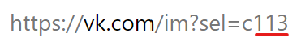

# all-generator

## Что это?
Генератор сообщений, упоминающих всех участников беседы.

## Зачем?
Для тех случаев, когда нет прав на использование `@all`, но очень хочется.

## Как?
Для работы понадобится установленный Node.js
1. Скачать код/клонировать репозиторий
2. Вписать свой логин и пароль в переменные LOGIN и PASSWORD соответственно в файле `index.js`.
3. Запустить скрипт  
    ```
    node index.js
    ```
4. Вписать id беседы, для которой нужно сгенерировать сообщение.

    Где найти id:  
    


## Где искать результат?
В консоль скрипт выведет количество людей в беседе, которую вы указали, а само сгенерированное сообщение будет записано в файл `output.txt`.
